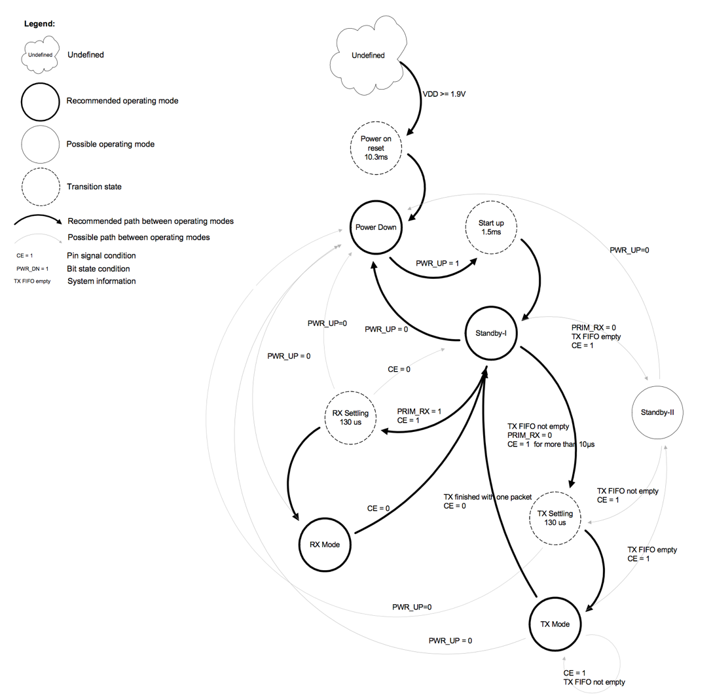

# nRF24L01에 대한 분석

Noedic Semiconductor에서 제작한 2.4GHz 기반 통신 칩에 대한 기초적인 분석자료입니다.

## 1. 기초 사양

> 2.4GHz 대역 통신
> 최대 2Mbps 속도로 통신 가능
> TX 0dBm 통신시 11.3mA 소비 / 2Mbps 통신시 12.3mA 소비
> 파워다운시 900nA
> 스텐바이시 22uA
> 1.9 ~ 3.6V 입력전압
> 126개의 RF 채널 구성 가능
> 저잡음 증폭기 (LNA) 이득 프로그래밍 가능
> 1~32바이트 데이터 전송
> 데이터 파이프 이용, 1:6 통신 가능
> SPI 통신, 8Mbps, 5V 신호입력 허용

## 2. 통신 컨트롤

 - 1) Power Down
최소한의 소비전력으로 작동됨, SPI 통신 이용가능, [CONFIG] 레지스터 조작으로 스텐바이 모드 진입 가능.
 - 2) Standby Mode
[CONFIG] 레지스터 조작으로 스텐바이 모드 진입. 또 CE 핀이 LOW일 때 스텐바이 모드.
스텐바이 II 모드에서 여분의 클럭 버퍼가 활성화됨. 스텐바이 I 모드에 비해 전력소비가 많음. TX 모드에서 CE핀이 HIGH임에도 불구하고 Tx FIFO가 비어있으면 스텐바이 II 모드가 됨.

 - 3) RX Mode
[CONFIG] 레지스터의 PRIM_RX 비트와 PWR_UP 비트가 셋 되고, CE pin이 high일 때 RX 모드가 됨.
이 모드에선 변조 모듈이 RF 채널에서 지속적으로 유효한 데이터 (주소 일치, CRC 유효) 데이터를 Rx FIFO에 쌓는다. 하지만 Rx FIFO가 비어있지 않으면 받은 패킷은 버려진다. 
모듈이 standby-I 모드가 되거나 power down 모드가 될 때까지 Rx 모드임.
RX 모드에서 carrier detect signal이 이용가능하면 [CD] (carrier detect) 는 RF 신호가 감지 될 때 high로 셋팅 된다. [CD] (carrier detect) 는 RX 모드일 때 시그널이 포착되면 high로 세팅 된다.
[CD] 레지스터가 high로 세팅될 때 최소한 128us 이후에 RF 시그널이 제공되어야 한다.
데이터쉬트 부록 E에 자세한 설명이 나와있다.

# 3. 통신 순서

 - 1) TX device가 RX device로 패킷을 보냄 (TX측의 TX_ADDR -> RX 측의 RX_ADDRx)
 - 2) RX device가 패킷을 받을시 ack을 보내는데 RX는 본인이 수신한 TX_ADDR 주소로 패킷을 보냄. 따라서 TX device의 RX_ADDR0은 반드시 TX_ADDR과 같아야 함